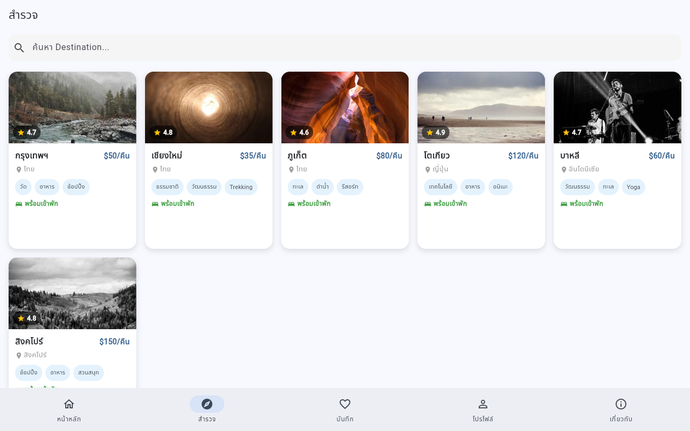
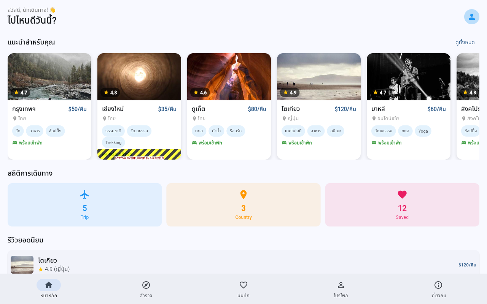
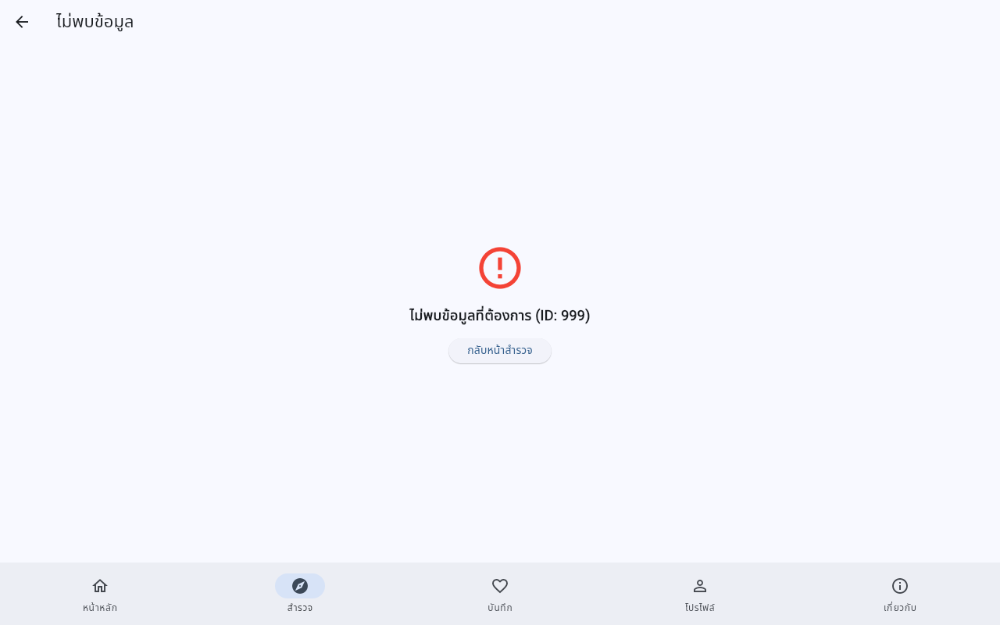
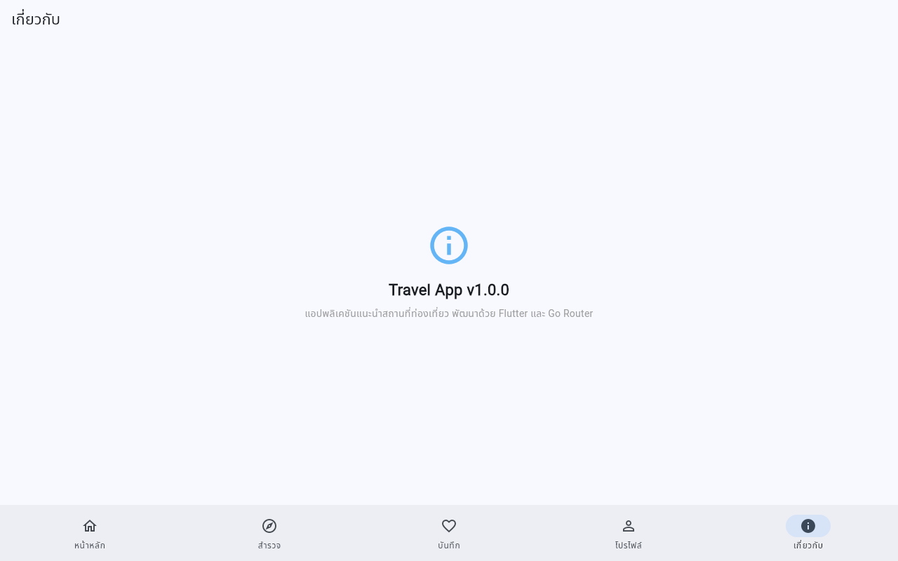
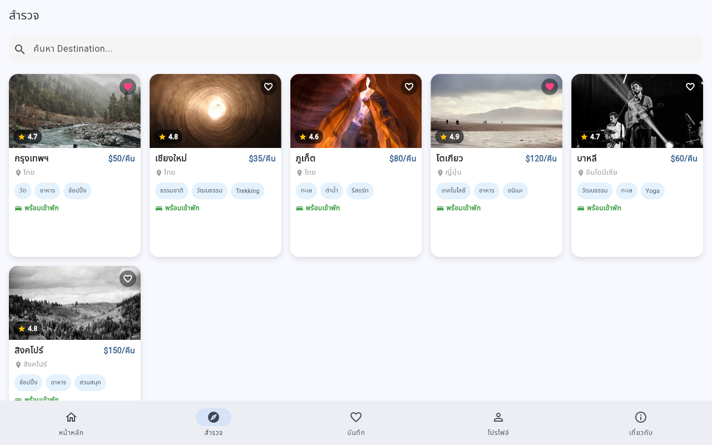
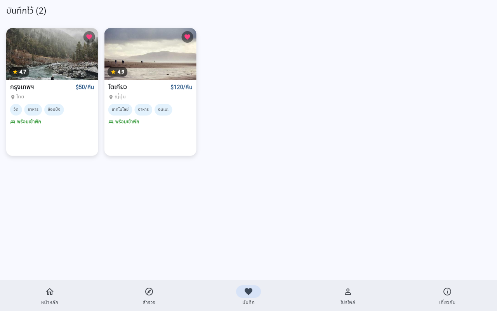
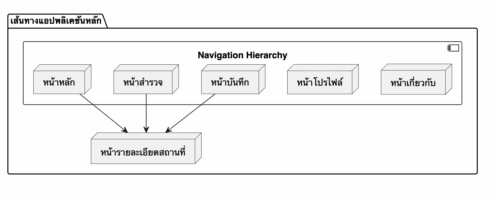

# ผลการทดลองและคำถามท้ายใบงาน

## รูปผลการทดลองตาม Checkpoints

### 1. Checkpoint 3 — แก้ไข DestinationCard


---

### 2. Checkpoint 4.1 — Responsive Grid (5 Columns ≥ 1200dp)


---

### 3. Checkpoint 4.3 — Featured List & Top Rated Section


---

### 4. Checkpoint 5.1 — Go Router (Fallback UI & About Screen)

#### Fallback UI กรณีไม่พบ ID (id: 999)


#### หน้าเกี่ยวกับ (About Screen)


---

### 5. การทดลองที่ 8 — Saved Screen (Independent Challenge)

#### การกดปุ่มหัวใจบันทึกสถานที่บนการ์ด


#### หน้า Saved Screen แสดงรายการสถานที่ที่บันทึกไว้จริง


---

## คำถามท้ายใบงาน

1. `LayoutBuilder` ต่างกับ `MediaQuery` อย่างไร? มีหลักการเลือกใช้แต่ละแบบในสถานการณ์ใด?

```text
LayoutBuilder คำนวณขนาดตามพื้นที่ที่ได้รับจากชิ้นส่วนแม่ เหมาะใช้จัดรูปแบบตามขนาดของแต่ละชิ้นส่วน ส่วน MediaQuery คำนวณขนาดจากหน้าจอทั้งหมด เหมาะใช้ตรวจสอบขนาดของอุปกรณ์โดยรวม
```

2. ทำไม Go Router ถึงใช้ `StatefulShellRoute` แทน `ShellRoute` ธรรมดา? ผลต่างเรื่อง State Management คืออะไร?

```text
StatefulShellRoute ช่วยรักษาสภาพการทำงานและข้อมูลของแต่ละหน้าไว้เมื่อสลับเมนู โดยไม่ทำลายข้อมูลเดิมทิ้งเหมือน ShellRoute ธรรมดา ทำให้ไม่ต้องโหลดข้อมูลใหม่ทุกครั้งที่สลับแท็บ
```

3. ในโค้ด `DestinationCard` เหตุใดจึงใช้ `Expanded` ครอบ `Text` ชื่อ Destination ? จะเกิดอะไรขึ้นถ้าลบออก?

```text
ใช้จำกัดพื้นที่ข้อความขยายตามขนาดที่เหลือและตัดด้วยจุดไข่ปลาเมื่อยาวเกินไป หากลบออกจะทำให้การ์ดเกิดข้อผิดพลาดการแสดงผลล้นขอบเมื่อชื่อสถานที่ยาวเกินไป
```

4. การส่งข้อมูลผ่าน `extra` ของ Go Router มีข้อจำกัดอะไรกรณี Deep Link / Web Refresh? และแก้ปัญหานี้ได้อย่างไร?

```text
ข้อมูลจะกลายเป็นค่าว่างเมื่อผู้ใช้กดโหลดหน้าเว็บใหม่หรือเข้าผ่านลิงก์ตรง แก้ไขโดยใช้ตัวแปรระบุตัวตนจากพารามิเตอร์ของเส้นทางไปค้นหาข้อมูลสำรองแทน
```

5. วาด Navigation Hierarchy ของแอปนี้ (สามารถวาดบนกระดาษแล้วถ่ายรูปส่งได้)


